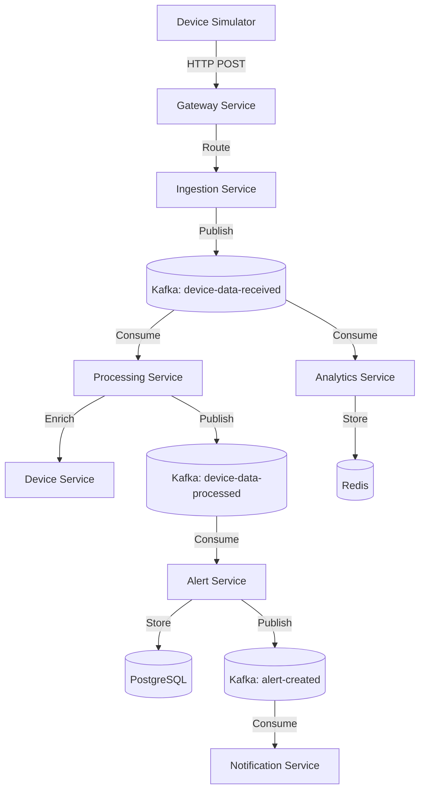

# spring-event-iot-platform

[](https://www.oracle.com/java/technologies/javase/jdk21-archive-downloads.html)
[](https://spring.io/projects/spring-boot)
[](https://kafka.apache.org/)

A distributed, event-driven IoT platform implemented using Spring Boot microservices and Apache Kafka. This system simulates IoT devices sending telemetry data, which is processed in real-time through a scalable Kafka-based architecture.

## 📋 Table of Contents

- [Project Overview](#project-overview)
- [Architecture](#architecture)
- [Technology Stack](#technology-stack)
- [Microservices Overview](#microservices-overview)
- [Event-Driven Design](#event-driven-design)
- [Deployment Instructions](#deployment-instructions)
- [Usage Examples](#usage-examples)
- [Device Simulator](#device-simulator)
- [Testing](#testing)
- [Observability](#observability)
- [Documentation Index](#documentation-index)

---

## 🚀 Project Overview

The **spring-event-iot-platform** demonstrates a modern approach to handling high-frequency telemetry data from IoT devices. By leveraging an event-driven architecture, the system ensures loose coupling between components, high scalability, and real-time processing capabilities.

### Key Features:
- **Real-time Telemetry Ingestion**: High-throughput ingestion of device data via REST.
- **Event-Driven Processing**: Asynchronous data enrichment and analysis using Kafka.
- **Anomaly Detection**: Automatic alert generation when telemetry values exceed thresholds.
- **Service Discovery & Gateway**: Dynamic routing and service management using Eureka and Spring Cloud Gateway.
- **Comprehensive Observability**: Integrated monitoring with Prometheus, Grafana, and Zipkin.
- **Standardized API**: Consistent DTOs, error handling, and documentation using MapStruct and OpenAPI.
- **Containerized Infrastructure**: Fully automated deployment using Docker Compose.

---

## 🛠️ Recent Improvements

This project has been recently refactored to reach **production-grade quality**:

- **Global Error Handling**: Implemented a centralized exception handling mechanism in `common-lib` using `@RestControllerAdvice`, ensuring all services return consistent `StandardErrorResponse` objects.
- **Standardized DTOs & Mappers**: Integrated **MapStruct** for efficient and type-safe conversion between entities and DTOs, reducing boilerplate and ensuring clear separation of concerns.
- **API Documentation**: Configured **SpringDoc OpenAPI (Swagger)** across all microservices, providing interactive API documentation at `/swagger-ui.html`.
- **Refactored Service Layer**: Decoupled controllers from repositories by introducing service classes, improving testability and adhering to SOLID principles.
- **Clean Code & Javadoc**: Performed a full audit of the codebase to remove code smells, simplify complex logic, and add comprehensive Javadoc to all public components.
- **Python ML Platform Optimization**: Improved code quality, documentation (PEP 257), and error handling in the Python-based ML components.

---

## 🏗️ Architecture

The platform follows a microservices pattern with a centralized event bus (Kafka) for asynchronous communication and Netflix Eureka for service discovery.

### High-Level Diagram



For a more detailed explanation, see [Architecture Documentation](docs/architecture.md).

---

## 🛠️ Technology Stack

| Component | Technology |
| :--- | :--- |
| **Language** | Java 21 |
| **Framework** | Spring Boot 3.4.1, Spring Cloud 2024.0.0 |
| **Event Streaming** | Apache Kafka 7.5.0 (Confluent) |
| **Database** | PostgreSQL 16, Redis 7 |
| **Service Discovery** | Netflix Eureka |
| **API Gateway** | Spring Cloud Gateway |
| **Monitoring** | Prometheus, Grafana |
| **Distributed Tracing** | Zipkin (Micrometer Tracing) |
| **Deployment** | Docker, Docker Compose |

---

## 📦 Microservices Overview

1.  **Gateway Service**: Entry point for all requests. Handles routing and security.
2.  **Discovery Service**: Service registration and discovery (Eureka).
3.  **Device Service**: Manages device metadata and registration (PostgreSQL).
4.  **Ingestion Service**: Receives telemetry and publishes to Kafka.
5.  **Processing Service**: Enriches telemetry with device metadata.
6.  **Alert Service**: Detects critical conditions and stores alerts (PostgreSQL).
7.  **Analytics Service**: Aggregates metrics and stores them in Redis.
8.  **Notification Service**: Simulates sending notifications (Email/SMS).

---

## 📬 Event-Driven Design

The system is built around three main Kafka topics:
- `device-data-received`: Raw telemetry from the ingestion service.
- `device-data-processed`: Enriched telemetry from the processing service.
- `alert-created`: High-severity alerts for the notification service.

Detailed flow sequence can be found in [Event Flow Documentation](docs/event-flow.md).

---

## ⚙️ Deployment Instructions

### Prerequisites:
- Docker and Docker Compose
- Java 21 (for local builds)
- Maven 3.9+

### Quick Start:
1.  **Clone the repository**:
    ```bash
    git clone https://github.com/franciscobalonero/spring-event-iot-platform.git
    cd spring-event-iot-platform
    ```
2.  **Build the project**:
    ```bash
    mvn clean package -DskipTests
    ```
3.  **Start the infrastructure**:
    ```bash
    docker compose up -d
    ```

Check the [Deployment Guide](docs/deployment.md) for detailed steps and port mappings.

---

## 📖 Documentation Index

- [Architecture Detail](docs/architecture.md)
- [System Design](docs/system-design.md)
- [Event Flow Detail](docs/event-flow.md)
- [Deployment Guide](docs/deployment.md)
- [Usage Guide](docs/usage.md)
- [Device Simulator](docs/device-simulator.md)
- [Testing Documentation](docs/testing.md)
- [Observability & Monitoring](docs/observability.md)
- [Troubleshooting](docs/troubleshooting.md)

---

## 👤 Author

**Francisco Balonero Olivera**
- [GitHub](https://github.com/franciscobalonero)
- [LinkedIn](https://www.linkedin.com/in/francisco-balonero-olivera/)

