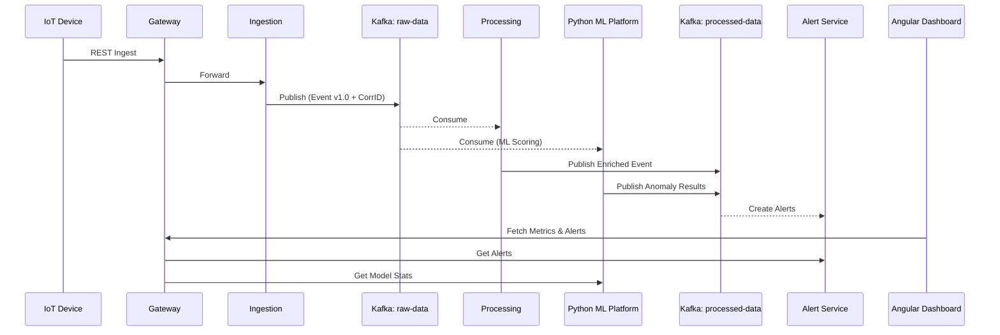

# System Architecture

## Overview

The `spring-event-iot-platform` follows a highly decoupled **microservices architecture** designed for high scalability and availability. The system is centered around an **asynchronous event-driven communication** pattern using Apache Kafka, supplemented by synchronous RESTful communication where appropriate.

## Architectural Components

### 1. Edge Layer (Gateway & Discovery)
- **Gateway Service**: Built with **Spring Cloud Gateway**, it acts as the primary entry point for all external traffic. It manages routing to downstream services, security, and load balancing.
- **Discovery Service**: A **Netflix Eureka** server that maintains a registry of all active microservice instances, enabling dynamic service-to-service communication.

### 2. Ingestion Layer
- **Ingestion Service**: Responsible for receiving raw telemetry data from IoT devices. It performs initial validation and converts the incoming REST requests into internal Kafka events published to the `device-data-received` topic.

### 3. Core Processing Layer
- **Processing Service**: Consumes raw telemetry events, enriches them by calling the **Device Service** (to fetch device type and metadata), and evaluates the telemetry status (e.g., NORMAL vs. CRITICAL).
- **Device Service**: Manages the persistent registry of IoT devices in a **PostgreSQL** database.

### 4. Intelligence & Alerting Layer
- **Alert Service**: Monitors processed telemetry events for critical conditions. When a threshold is breached, it persists an alert in its database and publishes an `alert-created` event.
- **Analytics Service**: Real-time aggregator that maintains live counters and statistics (e.g., event count per device) in a **Redis** cache.
- **ML Platform (Python)**: Advanced anomaly detection engine using Isolation Forest. It provides sophisticated feature engineering (rolling windows) and real-time scoring.

### 5. Dissemination & Visualization Layer
- **Notification Service**: Listens for alerts and simulates the delivery of notifications.
- **Angular Dashboard**: Modern web interface providing real-time telemetry visualization, KPI cards, alert management, and ML insights.

## Resilience and Reliability Features (Enterprise Grade)

### 1. Dead Letter Queues (DLQ)
All Kafka consumers are configured with DLQ topics (e.g., `device-data-received.DLQ`). Events that fail processing after all retry attempts are automatically routed here for manual investigation or reprocessing.

### 2. Retry Mechanism with Exponential Backoff
Services implement a robust retry policy for transient failures (like network glitches or service unavailability) ensuring high event delivery success rates.

### 3. Idempotent Processing
Processing services use **eventId tracking** stored in the database to ensure that duplicate Kafka messages (which can occur in "at-least-once" delivery models) are not processed multiple times.

### 4. Event Versioning
All events include schema versioning (`version` field) and type information (`eventType`), allowing for smooth architectural evolution and backward compatibility.

### 5. Request Tracing
A unified `correlationId` is propagated through all services and events, enabling complete end-to-end tracing of a single telemetry packet through the entire distributed system.

## Data Flow Diagram (Enhanced)

## Resilience and Scalability
- **Horizontal Scaling**: All services are stateless (except for their respective databases) and can be scaled horizontally.
- **Fault Tolerance**: Kafka acts as a buffer, allowing the system to continue ingesting data even if downstream processing services are temporarily unavailable.
- **Service Discovery**: Allows for dynamic scaling without hardcoded IP addresses.
